# AI 輔助旅遊景點推薦平台 (AI Travel Guide Website)


## 專案簡介

本專案為一款結合 AI 應用與現代網頁開發技術的旅遊景點推薦系統。專案完整涵蓋前端互動介面設計、後端 RESTful API 開發，以及資料庫關聯設計。

系統不僅提供景點瀏覽、多維度關鍵字篩選，更具備完整的會員驗證機制 (Authentication) 與專屬個人資料隔離 (Authorization)。透過 AI 輔助生成的高質感文案與視覺素材，致力於打造直覺、流暢且充滿靈感的旅遊規劃體驗。

---

## 技術堆疊 (Tech Stack)

### 前端技術 (Frontend)
* 核心框架：Vue.js (Composition API)
* UI 樣式與排版：HTML5, Tailwind CSS, 響應式設計 (RWD)
* 狀態與資料請求：JavaScript (Fetch API), JWT Token 管理
* 資料視覺化：Chart.js

### 後端技術 (Backend)
* 核心框架：PHP, Laravel Framework
* API 架構：RESTful API 設計風格
* 驗證機制：Token-based Authentication (使用者註冊/登入授權)

### 資料庫與工具 (Database & Tools)
* 資料庫：MySQL (透過 phpMyAdmin 進行視覺化管理)
* AI 輔助工具：ChatGPT / Gemini (文案生成、提示詞設計)、Midjourney / DALL·E (高解析度景點圖與 Banner 產出)

---

## 系統核心功能 (Core Features)

### 1. 互動式首頁與視覺導覽
提供高質感的品牌視覺 Banner、熱門景點與美食推薦區塊，並具備直覺的快速導覽列，引導使用者快速尋找旅遊靈感。
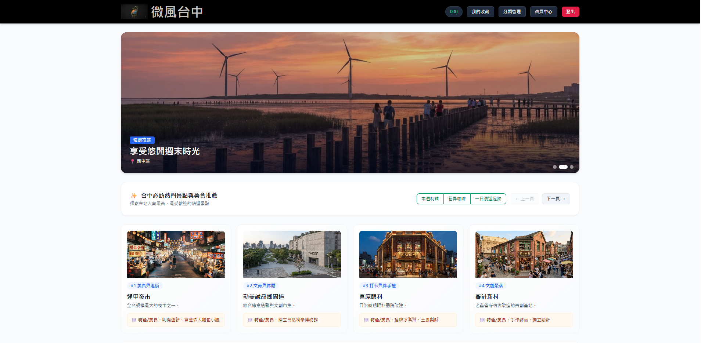 

### 2. 會員驗證與專屬工作區 (Data Isolation)
實作會員註冊與登入功能，採用 Bearer Token 進行 API 請求驗證。嚴格把關後端權限，確保每位使用者登入後，只能檢視、編輯與統計「屬於自己」的景點與分類資料，保障資料隱私。

### 3. 智慧化景點檢索系統
支援關鍵字即時搜尋（針對名稱與地址）、縣市地區精準篩選、動態分類標籤，以及自訂排序功能，協助使用者在龐大資料中精準定位行程。
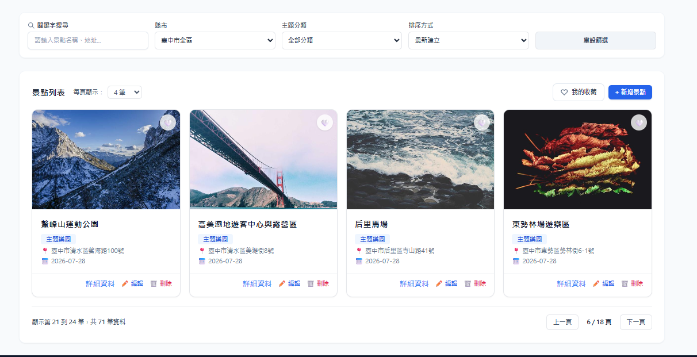

### 4. 景點與分類管理後台 (CRUD)
提供完整的資料管理能力。包含景點與分類的新增 (Create)、讀取 (Read)、修改 (Update) 與刪除 (Delete)。
表單內建嚴謹的前後端雙重防呆驗證（例如：地址必須同時包含縣市與行政區），並提供明確的操作狀態回饋 (Toast/Alert)。
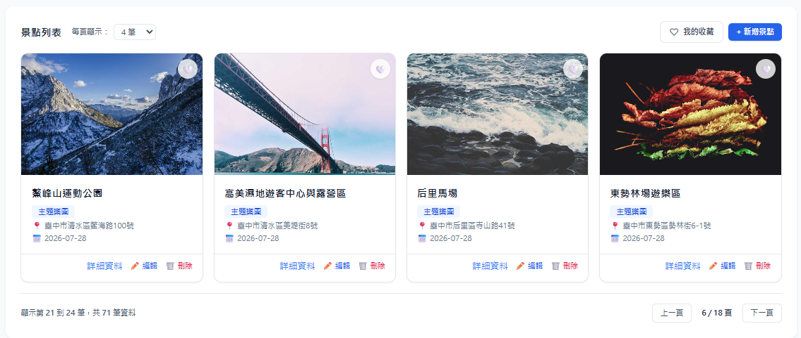
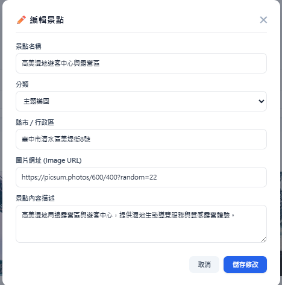
### 5. 個人化儀表板與數據統計
系統會根據當前登入使用者的建立紀錄，直觀展示景點與分類總數，並利用 Chart.js 將分類佔比轉化為環形圓餅圖，讓繁雜數據一目了然。
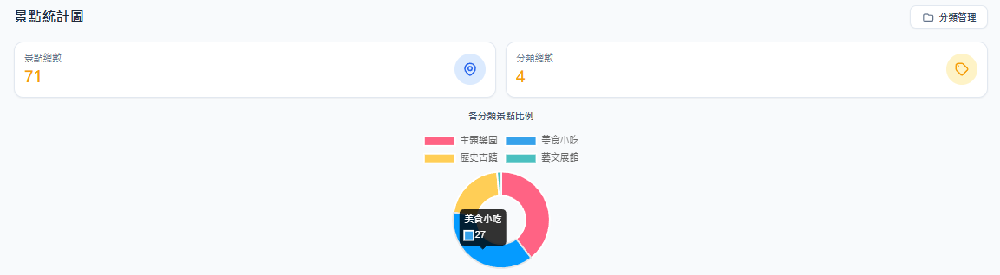

---

## 資料庫架構 (Database Schema)

系統核心採用關聯式資料庫設計，確保資料的一致性與完整性，並透過 user_id 作為資料隔離的基礎：

* users (會員資料表)：儲存使用者帳號、密碼雜湊與基本資訊。
* categories (分類資料表)：使用者自訂的景點分類，關聯至特定 user_id。
* attractions (景點資料表)：
  * 包含 name、city、image_url、description 等欄位。
  * 具備外鍵關聯至 user_id (擁有者) 與 category_id (所屬分類)。
* favorite_attraction (收藏關聯表)：多對多 (Many-to-Many) 關聯表，記錄使用者收藏了哪些特定景點。

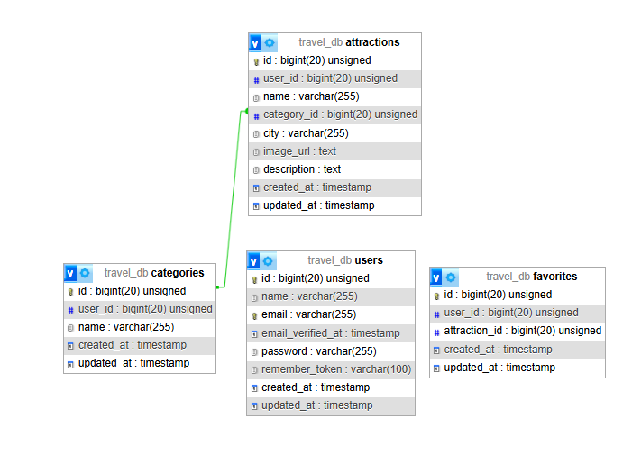

---

## API 路由設計 (API Endpoints)

後端提供完整且具備安全驗證的 RESTful API 供前端介接（所有需授權的路由皆須於 Header 夾帶 JWT Token）：

| HTTP 方法 | 路由端點 (Endpoint) | 功能說明 | 權限要求 |
| :--- | :--- | :--- | :--- |
| POST | `/api/register` | 會員註冊 | 無 |
| POST | `/api/login` | 會員登入並獲取 Token | 無 |
| GET | `/api/attractions` | 取得景點列表 (支援分頁與搜尋參數) | 需登入 |
| POST | `/api/attractions` | 新增個人景點 | 需登入 |
| PUT | `/api/attractions/{id}` | 更新特定景點資料 | 需登入 (僅限擁有者) |
| DELETE| `/api/attractions/{id}` | 刪除特定景點 | 需登入 (僅限擁有者) |
| GET | `/api/attractions/statistics`| 取得儀表板統計圖表數據 | 需登入 |

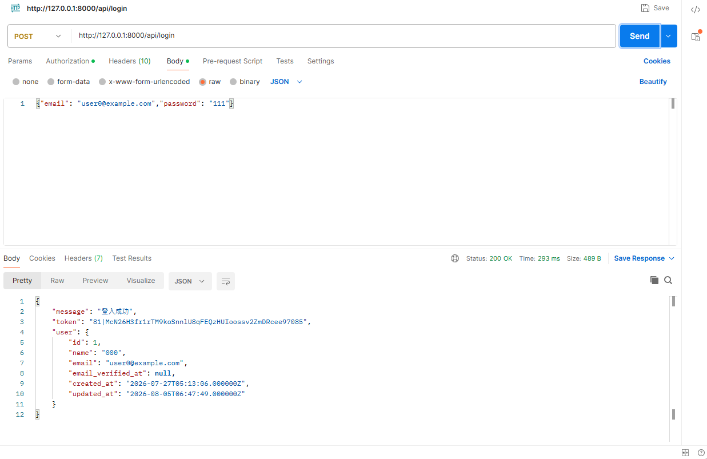
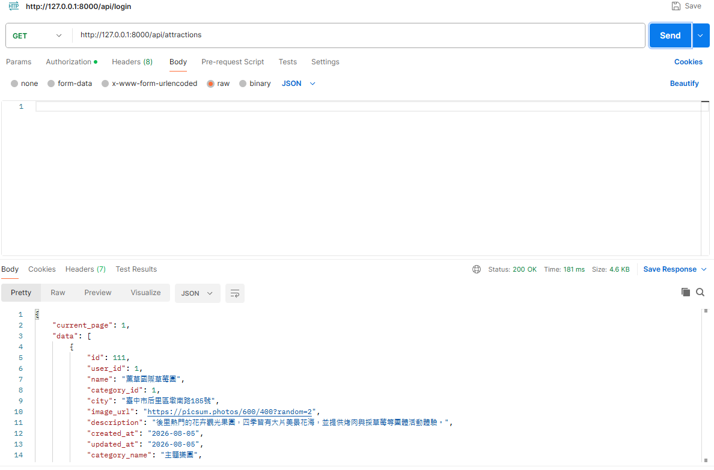

---

## AI 應用場景 (AI Integration)

* 文案生成與潤飾：運用生成式 AI（ChatGPT / Gemini）協助撰寫吸引人的景點介紹、提示詞設計及測試假資料產出，降低內容產出成本。
* 視覺素材生成：使用 AI 圖像生成工具產出高解析度的網站 Banner 與預設景點封面圖，大幅提升專案整體的視覺質感與一致性。

---

## 系統測試紀錄 (Testing Documentation)

### 測試項目一：表單防呆與資料驗證 (Validation Testing)
* 測試情境：於新增景點時，刻意輸入不完整的地址（缺少縣市或行政區），或留空必填欄位。
* 實際結果：後端 Laravel Request Validation 成功攔截無效請求 (422 Unprocessable Entity)，前端接收錯誤後，精準在對應的輸入框下方顯示紅色錯誤提示，有效維持資料庫的資料品質。

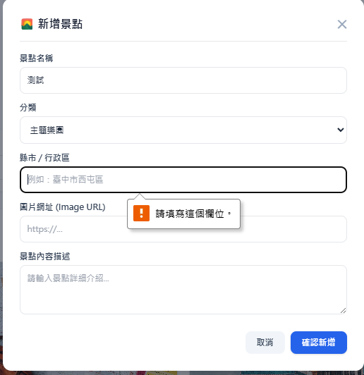
---

### 測試項目二：RWD 響應式排版與跨裝置測試 (Responsive Web Design)
* 測試情境：模擬桌面版 (1200px)、平板版 (768px) 及手機版 (375px) 檢視系統介面。
* 實際結果：各尺寸斷點下的版面皆能自動適應。手機版導覽列順利轉換為收合式漢堡選單，Grid 卡片排版從四欄自動轉為單欄，無水平捲軸溢出狀況。

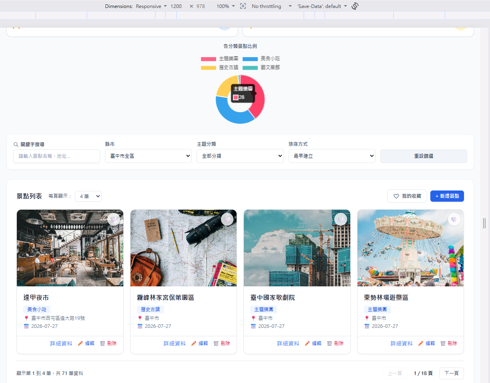
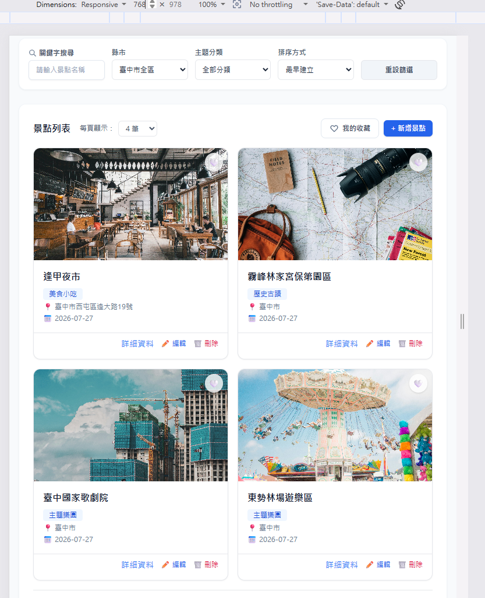
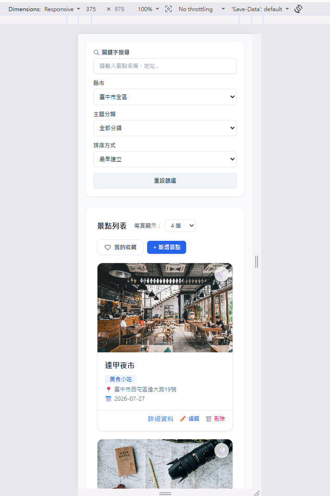
---

## 快速啟動 (Getting Started)

若想在本地端運行此專案，請確保您的環境已安裝 PHP (8.2+), Composer, Node.js, MySQL 以及本地伺服器環境 (如 XAMPP / Laragon)。

### 1. 取得專案程式碼
```bash
git clone [https://github.com/qwer070591-arch/travel-project.git](https://github.com/qwer070591-arch/travel-project.git)
cd travel-project
```
### 2. 安裝後端 PHP 依賴套件
composer install

### 3. 環境設定與資料庫遷移
* 複製環境設定檔
cp .env.example .env

* 生成應用程式金鑰
php artisan key:generate

* 請先至 .env 檔案中設定您的資料庫連線資訊 (DB_DATABASE, DB_USERNAME, DB_PASSWORD)
* 執行資料庫遷移與資料填充
php artisan migrate

### 4. 安裝前端依賴並啟動專案
* 安裝前端套件
npm install

* 編譯前端資源或啟動開發伺服器
npm run dev

### 5. 啟動後端伺服器
php artisan serve